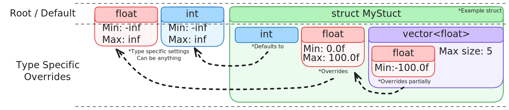

# FluentBuilderPattern

C++ Scope based fluent builders pattern

## CI/CD

This project includes automated testing via GitHub Actions. All pull requests to the `main` branch are automatically tested to ensure code quality and functionality.

### Running Tests Locally

The project uses Google Test for unit testing. To run tests locally:

1. Open the solution in Visual Studio
2. Restore NuGet packages
3. Build the solution (Release/x64 recommended)
4. Run the UnitTests project

### GitHub Actions Workflow

The CI workflow automatically:
- Restores NuGet packages
- Builds the entire solution
- Runs all unit tests
- Uploads test results as artifacts

This ensures that all changes are properly tested before being merged into the main branch.
